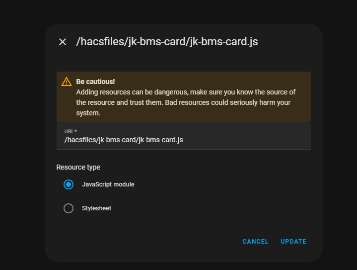

I liked the layout of [Inspiration](https://github.com/syssi/esphome-jk-bms/discussions/230), but wanted the native functionality of clicking on an entity to see the history. So I created this simplistic card

inspired from: https://github.com/syssi/esphome-jk-bms/discussions/230
integration from: https://github.com/syssi/esphome-jk-bms/tree/main

## Prefix:
if your entities start with **jk_bms**_total_voltage, your prefix will be **jk_bms**

### Manual Installation

1. Create a new directory under `www` and name it `jk-bms-card` e.g `www/jk-bms-card/`.
2. Copy the `jk-bms-card.js` into the directory.
3. Add the resource to your Dashboard. You can append the filename with a `?ver=x` and increment x each time you download a new version to force a reload and avoid using a cached version. It is also a good idea to clear your browser cache.

PR's are welcomed. 